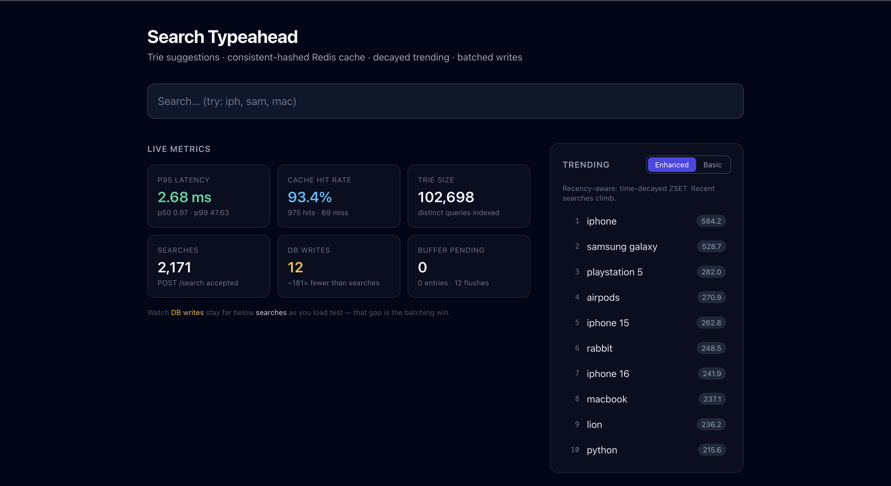
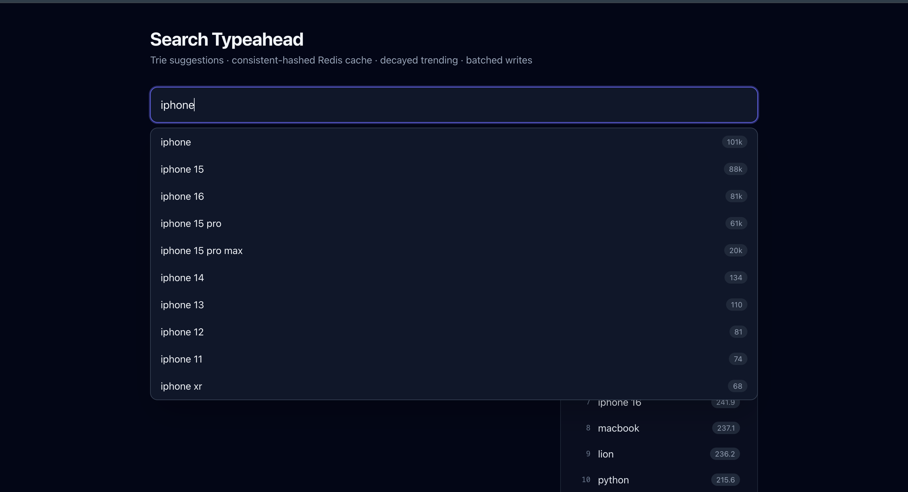
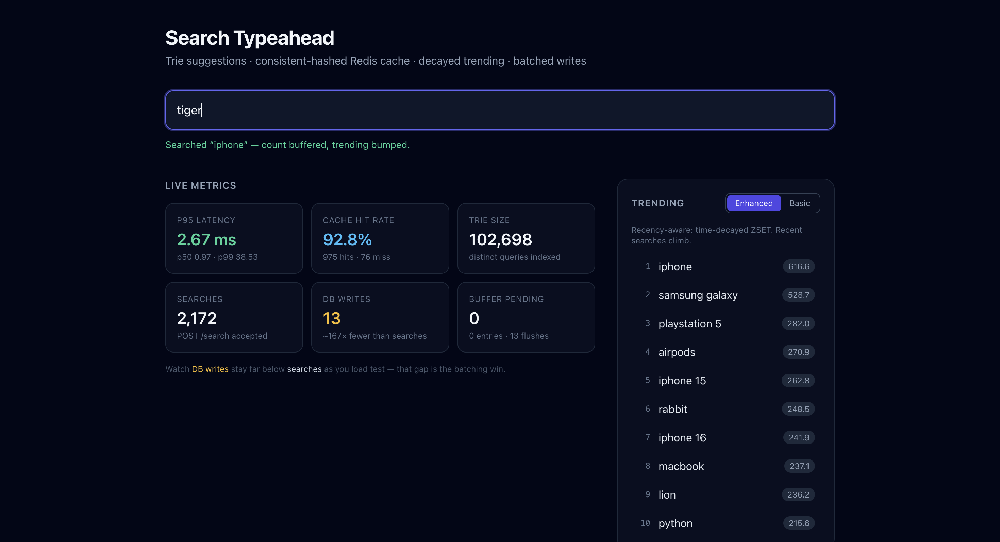
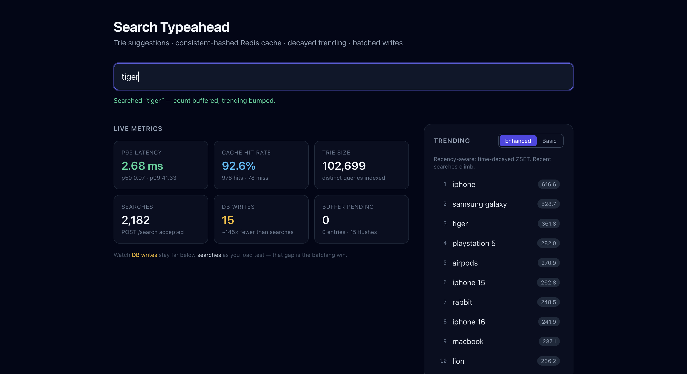

# Search Typeahead System

A production-inspired **Search Typeahead (Autocomplete) Engine** engineered for
extremely low-latency reads and reduced database write pressure.

This project demonstrates backend data-system design patterns: an in-memory
**Trie** prefix index, **distributed caching across 3 real Redis instances**
routed by **consistent hashing**, **cache-aside** reads with TTL, **in-memory
write batching**, and a recency-aware **time-decayed trending** ranking — all
served behind a clean React UI with a live metrics dashboard.

> Design-first build: every major component is paired with *why* it was chosen and
> *what it trades off*. The full rationale lives in [`docs/architecture.md`](docs/architecture.md)
> and inline in the code.

---

## Screenshots

**Live metrics dashboard + recency-aware trending** — p95 latency, cache hit rate,
trie size, and the headline *DB writes ≪ searches* gap, beside the time-decayed
trending list.
<p align="center">
  
</p>

**Typeahead suggestions** — typing `iphone` returns the top-10 completions sorted
by count (101k → 68), served from the consistent-hashed Redis cache (O(L) trie on miss).
<p align="center">
  
</p>

**Search submission + batching** — submitting a search buffers the count and bumps
trending; the DB-write counter (13) stays far below the search count (2,172) — one
batched UPSERT per flush window.
<p align="center">
  
</p>

**Recency in action** — after repeated searches, the brand-new query `tiger` climbs
into the enhanced (time-decayed) trending list at #3, demonstrating both *new-query
becomes suggestible* and *recency-aware ranking*.
<p align="center">
  
</p>

## Demo Video

[Watch the demo](https://youtu.be/mHVMUVb0KeY)

---

## 1. Project Overview

A **Typeahead System** predicts a user's search query as they type, reducing
keystrokes and guiding them toward popular content.

**The problem.** Autocomplete APIs face extreme **read-heavy** workloads. A user
typing "iphone" generates a request per keystroke after the input debounce
settles (`ip`, `iph`, `ipho`, …). Querying a relational database for prefix
matches across ~100k+ rows on *every* keystroke would exhaust connection pools and
crush DB performance.

**Why low latency matters.** To feel instant, suggestions must render in well
under 100 ms. We achieve this with two layers in front of Postgres:

1. An in-memory **Trie** that answers any prefix in **O(L)** (L = prefix length),
   independent of dataset size.
2. A **Redis cache** that stores the computed top-10 per prefix, so warm prefixes
   never even touch the trie compute.

PostgreSQL remains the durable **source of truth**; cache misses fall back to the
trie and lazily back-fill Redis.

The frontend reduces noise with a **300 ms debounce** on the input, so
intermediate keystrokes don't each fire a network call.

---

## 2. Assignment Requirements

The system implements all core and advanced requirements:

* **Typeahead Suggestions** — real-time prefix completion via an in-memory Trie.
* **Top 10 Suggestions** — results bounded to the 10 most popular matches.
* **Prefix Matching** — O(L) character-walk, independent of dataset size.
* **Search Submission** — `POST /search` updates query-count data.
* **Caching for Low Latency** — query-count results cached in Redis (cache-aside).
* **Distributed Cache** — **3 real Redis instances** via Docker Compose.
* **Consistent Hashing** — ring with virtual nodes shards suggestion keys across nodes.
* **Trending Searches** — recency-aware ranking via a time-decayed Redis ZSET (the +20%).
* **Batch Writes** — in-memory aggregation flushed to Postgres in batched UPSERTs.
* **Debouncing** — 300 ms frontend delay to cut network noise.
* **Observability** — live `/stats` dashboard: latency percentiles, hit rate, write reduction.
* **Interactive API Docs** — Swagger UI at `/api-docs` from a hand-written OpenAPI 3 spec.

---

## 3. Dataset

The system is seeded from a **synthetically generated, realistic** query dataset.

* **Rows loaded:** **102,682 unique queries** (header `query,count`).
* **Distribution:** Zipfian — a curated marquee head (e.g. `iphone` = 100,000)
  down to a long tail of count-1 queries.
* **Construction:** clean by design — realistic per-brand vocabulary, no
  cross-brand nonsense, storage variants only on storage-capable items.
* **Reproducible:** [`data/generate_dataset.py`](data/generate_dataset.py) uses
  `seed=42`, so it regenerates byte-identically — kept in the repo as the
  "here's how I built my data" artifact.

### Loading the dataset

The dataset is already generated at [`data/queries.csv`](data/queries.csv). The
seed script bulk-loads it into Postgres via the fast `COPY` path:

```bash
npm run seed     # truncates + loads data/queries.csv -> queries table
# -> "queries table now has 102682 rows"
```

To regenerate the CSV from scratch (deterministic):

```bash
cd data && python3 generate_dataset.py
```

---

## 4. System Architecture

The architecture decouples the high-volume **read path** from the bursty **write
path**, with Postgres as truth, a Trie as the index, and Redis as the cache.

### Components

* **Frontend** — React + Vite + Tailwind SPA: debounced input, keyboard nav, live dashboards.
* **Express API** — stateless Node.js backend orchestrating reads, writes, and metrics.
* **Trie (in-memory)** — prefix index + authoritative `query→count` map, built from Postgres at startup.
* **Redis ×3** — in-memory suggestion cache, sharded by consistent hashing.
* **Batch Buffer** — in-memory `Map` aggregating search increments before flush.
* **Trending ZSET** — single Redis sorted set with exponential time decay (lives on node 0).
* **PostgreSQL** — durable source of truth for `query→count`.
* **Metrics Service** — in-process counters surfaced via `/stats`.

### Architecture diagram

```text
                    ┌──────────────────────────────┐
   Browser (React)  │  Search box + suggestions     │
   debounce 300ms   │  dropdown + trending + stats  │
                    └───────────────┬───────────────┘
                                    │ HTTP (JSON)
                    ┌───────────────▼───────────────┐
                    │        Express API server      │
                    │                                │
   GET /suggest ───▶│  cache-aside read path         │
                    │   1. hash prefix → ring → node  │──▶ Redis node (suggest:* keys)
                    │   2. HIT → return                │     (1 of 3, by consistent hash)
                    │   3. MISS → trie compute,        │
                    │      return, back-fill cache     │
                    │                                  │
   POST /search ───▶│  - increment buffer (Map)        │
                    │  - ZINCRBY trending (decayed)    │──▶ Redis node 0 (trending ZSET)
                    │  - return {message:"Searched"}   │
                    │                                  │
   batch flush  ───▶│  buffer → Postgres upsert        │──▶ PostgreSQL (source of truth)
   (timer/size)     │                                  │
                    │  Trie (in-memory) ◀──────────────│◀── loaded from Postgres at startup
                    └──────────────────────────────────┘
```

### Two decoupled clocks (key design point)

* The **batch-flush clock** keeps *Postgres* fresh (writes buffered increments).
* The **cache-TTL clock** decides when *Redis* re-reads truth.

A flush updating Postgres does **not** touch Redis; only TTL expiry pulls fresh
data into the suggestion cache. They are independent by design.

---

## 5. Read Path

Executed on `GET /suggest?q=<prefix>`.

**Flow:**
1. Frontend debounces input (300 ms) and sends the request.
2. The prefix is normalized (`toLowerCase().trim()`), hashed through the
   **consistent-hash ring**, and routed to the responsible Redis node.
3. **Cache Hit:** Redis returns the pre-computed, pre-sorted top-10 immediately.
4. **Cache Miss:**
   - Compute the top-10 from the **Trie** (a bounded traversal of the prefix's subtree).
   - Return the result to the user.
   - **Back-fill** the routed Redis node with a TTL so the next request hits.

This is a classic **Cache-Aside** pattern. The user *always* gets an answer — a
miss is merely *slower* (one O(L) compute), never empty. Because the trie compute
is itself cheap, the database is shielded from prefix-scan thundering herds while
remaining the source of truth.

---

## 6. Write Path

Executed on `POST /search` with body `{ "query": "<text>" }`.

**Flow:**
1. Normalize the query (`trim().toLowerCase()`). Empty after trimming → ignored
   (no blank entry created).
2. Push a `+1` increment into the in-memory **`Map` buffer** — **not** a synchronous
   DB write. Repeated searches **aggregate** into the same key.
3. `ZINCRBY` the trending ZSET with a **time-decayed** increment.
4. If the query is brand-new, insert it into the Trie + count map so it becomes
   suggestible immediately.
5. Return exactly `{ "message": "Searched" }` in O(1).

### Batch flush

The buffer drains to Postgres when **either** trigger fires first (both configurable):

* **Time-based:** every `FLUSH_INTERVAL_MS` (default **5,000 ms**).
* **Size-based:** when the buffer reaches `FLUSH_MAX_ENTRIES` distinct queries (default **100**).

The flush is a **single** batched statement applying every aggregated increment:

```sql
INSERT INTO queries (query, count) VALUES ($1,$2), ($3,$4), ...
ON CONFLICT (query) DO UPDATE SET count = queries.count + EXCLUDED.count;
```

**Why batching?** If 1,000 users search "iphone" within a few seconds, direct
writes would trigger 1,000 separate `UPDATE`s, hammering disk I/O. By aggregating
in memory, we execute **one** UPSERT mapping `iphone → +1000`.

**Crash semantics (owned).** Buffered increments live in memory, so a crash before
flush loses that window. This is acceptable — these are approximate
search-analytics counts, not transactional data. (The server also flushes on
`SIGINT`/`SIGTERM` for clean shutdowns.)

---

## 7. Ranking Algorithm

There are **two deliberately different** rankings, kept separate so the
basic-vs-enhanced comparison stays clean:

### Suggestions (basic, historical)
Sorted by **`count` descending, then alphabetical** for ties — deterministic, and
intentionally "dumb." No recency is mixed in here. This represents stable
historical popularity, and its stability is what lets us cache aggressively (small
count changes rarely reorder the top-10).

### Trending (enhanced, recency-aware)
Ordered by a **time-decayed score** (see §8). This is where recency lives. A term
searched a lot *recently* climbs above a historical giant that's gone quiet —
without the suggestion ordering ever flickering.

---

## 8. Trending & Time Decay

Trending is a single **Redis Sorted Set (ZSET)** — it *is* the live ranking
(store + fast read surface in one), so there is **nothing separate to invalidate**.

**Why decay (not plain `ZINCRBY 1`)?** A plain increment only ever grows, so a
one-time old spike would rank forever — that's "all-time count in a fancy
container," not trending. We make recent activity dominate **without any cleanup
job** using exponential time weighting:

```text
On each search:   ZINCRBY trending  exp(t / TAU)  <query>
```

where `t` = seconds since a fixed epoch and `TAU` = decay constant
(`TRENDING_TAU_SECONDS`, default **720 s ≈ 12 min**). A search *now* adds
`exp(now/TAU)`; an older search added an exponentially smaller value, so old
contributions become proportionally negligible — **decay without ever
subtracting**. τ is chosen by half-life: activity from ~`τ·ln2` ago counts half as
much as now.

**Seeding at startup.** Trending would start empty (it only accrues from live
searches), so we seed it from historical counts — **normalized to the live scale**.
Raw counts (up to 100,000) would otherwise either swamp live activity forever or be
instantly buried (live increments are `exp(t/τ)`-scaled, ~1.0 at `t=0`). So the top
historical term is mapped to `TRENDING_SEED_BASELINE` (default **300**) and the rest
scale proportionally — live searches then climb past mid-tier seeds within the demo
window, and you watch a term overtake its historical peers live.

**Known limitation (volunteered).** Scores grow exponentially and would eventually
get numerically large; a long-lived system would periodically rebase the epoch.
Fine for the assignment's lifespan.

`GET /trending?mode=enhanced` returns the decayed list; `?mode=basic` returns the
raw all-time list for side-by-side comparison.

---

## 9. Redis Design

### Suggestion cache (sharded across 3 nodes)

* **Key format:** `suggest:<prefix>` (e.g. `suggest:iph`).
* **Value:** a JSON list of the top-10 `{ query, count }`, where `count` is a
  **rounded snapshot** taken at write time. Exact live counts are *not* cached, so
  a count ticking `88000 → 88003` never churns the cache (the order didn't change).
* **Invalidation:** **TTL-only** (`SET ... EX <ttl>`, default `SUGGEST_TTL_SECONDS`
  = **600 s**). Orderings are stable, so we favor hit rate and accept ≤ TTL
  staleness on ordering. The batch clock and TTL clock are decoupled on purpose.
* **Bounded memory:** each key stores only the top 10 — prefixes are created
  **lazily** on a cache miss, never precomputed for every possible prefix.

### Trending ZSET (single key, one node)

The trending ZSET is **one key**, and a single key cannot be partitioned — so it
lives **outside the ring** on one designated node (`TRENDING_NODE_INDEX`, default
node 0). Operations:

* **`ZINCRBY`** — O(log N) decayed increment per search.
* **`ZREVRANGE … WITHSCORES`** — O(log N + K) top-K read.

> Honest framing: "consistent hashing distributes everything" is not quite true —
> it distributes the **suggestion cache**. The trending ZSET is a deliberate
> single-node exception.

---

## 10. Consistent Hashing

Cache keys are sharded across **3 real Redis instances** (ports 6379/6380/6381) via
a `ConsistentHashRing`. Every suggestion read/write is routed through the ring to
pick the responsible node.

**Why consistent hashing?** With naive modulo hashing (`hash(key) % N`), adding or
removing a node changes the denominator and remaps **nearly every** key, triggering
a cache stampede against Postgres.

**The solution.** Both nodes and keys are mapped onto a 32-bit circular ring (keys
hashed with MD5, truncated). A key walks **clockwise** to the first node point it
meets.

```text
                 Hash Ring
                redis-node-0
                     |
                     |
   redis-node-2 ───────────── redis-node-1

   iph → node1     sam → node0     mac → node2
```

* **Minimal key movement.** Removing a node reassigns only the keys in *that node's*
  arcs (~**1/N** of keys); everything else stays put.
* **Virtual nodes.** Each physical node is placed on the ring **~150 times**
  (`RING_VIRTUAL_NODES`). Without this, 3 random points carve uneven arcs and one
  node hot-spots; 150 virtual points per node smooth the distribution toward uniform.

You can inspect the live distribution at `GET /cache/debug?prefix=<p>` (returns the
routed node + the fraction of keyspace each node owns — measured ~31.6% / 31.4% /
37.0% in this build).

> **Honest framing:** 3 Redis on one machine demonstrate real **routing and
> partitioning**, not throughput scaling (one box, one CPU). The routing logic
> extends to multiple physical hosts with no application change.

---

## 11. Metrics

In-process counters track system health in real time, exposed via `GET /stats` and
the live UI panel:

* **Latency** — rolling window of `/suggest` durations → **p50 / p95 / p99**.
* **Cache Hits / Misses / Hit Rate** — the cache-aside read path.
* **DB Reads / Writes** — the **write counter proves batching** (writes ≪ searches).
* **Search Count** — total `POST /search` accepted.
* **Buffer State** — pending increments, distinct pending entries, total flushes.
* **Trie Size** — distinct queries indexed.

---

## 12. API Documentation

Interactive **Swagger UI** is available at:

```text
http://localhost:4000/api-docs
```

It renders a hand-written OpenAPI 3.0 spec ([`docs/openapi.yaml`](docs/openapi.yaml))
covering every endpoint with exact shapes and try-it-out support. A static
reference also lives in [`docs/api.md`](docs/api.md).

### Suggestions
**`GET /suggest?q=<prefix>`** — up to 10 suggestions, sorted by count desc then alpha.
```json
{
  "prefix": "iph",
  "suggestions": [
    { "query": "iphone", "count": 100000 },
    { "query": "iphone 15", "count": 88000 }
  ]
}
```

### Search
**`POST /search`** — buffers an increment, bumps trending, returns immediately.
```json
// Request
{ "query": "iphone" }
// Response
{ "message": "Searched" }
```

### Trending
**`GET /trending?mode=enhanced|basic`** — top-N trending (default `enhanced`).
```json
// enhanced (decayed score)
{ "mode": "enhanced", "items": [ { "query": "iphone", "score": 301.03 } ] }
// basic (all-time count)
{ "mode": "basic", "items": [ { "query": "iphone", "count": 100001 } ] }
```

### Diagnostics
* **`GET /cache/debug?prefix=<p>`** — routed Redis node, cache hit/miss, ring distribution, virtual-node count.
* **`GET /stats`** — full metrics snapshot (latency percentiles, hit rate, db counts, buffer, trie size).
* **`GET /health`** — Redis nodes + Postgres reachability (`200` ok / `503` degraded).

---

## 13. Frontend Features

A modern React + Vite + Tailwind application:

* **Debounced Input** — 300 ms pause before network calls, cutting requests for
  intermediate keystrokes (visible as reduced request count in the metrics).
* **Keyboard Navigation** — full `ArrowUp` / `ArrowDown` / `Enter` support; counts
  rendered compact (`"88k"`).
* **Loading & Empty States** — the dropdown hides on empty results; errors surface gracefully.
* **Trending Dashboard** — polls every 4 s, with a **basic ↔ enhanced** toggle for
  the side-by-side recency demo.
* **System Metrics Dashboard** — polls every 2 s to visualize p95 latency, cache
  hit rate, and the headline **DB writes ≪ searches** gap.

---

## 14. Design Tradeoffs

* **Cache-Aside vs Write-Through** — Cache-Aside chosen: the spec wants fallback
  semantics, and lazy back-fill avoids synchronously maintaining many prefix keys
  on every write.
* **TTL-only invalidation** — top-k orderings are stable, so we favor hit rate and
  accept ≤ TTL staleness. The flush clock and TTL clock are decoupled.
* **Batch Writes vs Immediate Consistency** — traded immediate consistency for
  availability; a search reflects within a few seconds, an acceptable analytics
  tradeoff that lets the DB survive spikes.
* **Trie vs precomputed prefix→top10 map** — the Trie gives O(L) lookups without the
  memory explosion / painful updates of precomputing every prefix's results.
* **Sorted Set for trending vs JSON blob** — a ZSET maintains order natively with
  O(log N) granular score updates; a JSON blob would require fetch-parse-mutate-reserialize.
* **3 real Redis on one machine** — demonstrates routing/partitioning honestly,
  rather than faking a cluster; the ring extends to real hosts unchanged.

---

## 15. Running the Project

### Prerequisites
* **Docker** + **Docker Compose** (for Postgres + 3 Redis instances)
* **Node.js ≥ 18** (uses global `fetch`)

### 1. Start the infra (Postgres + 3 Redis)
```bash
docker compose up -d
```
Postgres on `5432`; Redis on `6379`, `6380`, `6381`.

### 2. Install server deps + seed the dataset
```bash
cp .env.example .env        # tweak knobs if you like
npm install
npm run seed                # loads data/queries.csv (~102,682 rows)
```

### 3. Start the API server
```bash
npm run dev                 # or: npm start  → http://localhost:4000
```
On startup it builds the Trie from Postgres and seeds trending (normalized).

### 4. Start the frontend
```bash
cd client
npm install
npm run dev                 # → http://localhost:5173
```
The client proxies `/api/*` to the server (no CORS setup needed).

### 5. (Optional) Drive traffic for the demo
```bash
npm run loadtest            # fires suggests + weighted searches, prints /stats
```

### Quick smoke test
```bash
curl 'http://localhost:4000/suggest?q=iph'
curl -X POST http://localhost:4000/search -H 'Content-Type: application/json' -d '{"query":"iphone"}'
curl 'http://localhost:4000/trending?mode=enhanced'
curl 'http://localhost:4000/cache/debug?prefix=iph'
curl 'http://localhost:4000/stats'
curl 'http://localhost:4000/health'
```

---

## 16. Database Schema

```sql
CREATE TABLE IF NOT EXISTS queries (
  query TEXT PRIMARY KEY,
  count BIGINT NOT NULL DEFAULT 0
);
```

The primary key on `query` gives fast UPSERT lookups for the batch flush. **No
prefix index** is needed in Postgres — prefix matching is the Trie's job, not the
DB's. The startup load reads every row once to build the trie; the DB never serves
a prefix query.

---

## 17. Performance Report

### Benchmark environment
* **Stack:** Node.js + Express, PostgreSQL 16, Redis 7 (×3), all via Docker Compose
* **Machine:** local development host (single box)
* **Method:** `scripts/loadtest.js` against a cold cache + freshly zeroed metrics

### Read latency (cache miss vs hit)
Measured across 10 fresh prefixes (first request = miss + back-fill, immediate
repeat = hit):

| Metric | Latency |
|---|---|
| Average Cache Miss (trie compute + back-fill) | 1.93 ms |
| Average Cache Hit (served from Redis) | 1.27 ms |
| **Speedup** | **~1.5×** |

> Note: even misses are fast because the Trie answers in **O(L)** — the cache layer
> adds a further win on top of an already-cheap compute, rather than rescuing a slow
> one. Under the concurrent load burst, steady-state **p50 ≈ 1 ms** (p95/p99 are
> inflated by cold-start JIT and the initial 50-way concurrent burst).

### Cache efficiency (1,000 suggests, cold start)
| Metric | Value |
|---|---|
| Cache Hits | 961 |
| Cache Misses | 39 |
| **Cache Hit Rate** | **96.1%** |

### Write reduction (2,000 searches)
| Metric | Value |
|---|---|
| Searches submitted | 2,000 |
| Distinct buffer entries (aggregated) | 11 |
| Potential DB writes | 2,000 |
| **Actual DB writes (batched UPSERTs)** | **1** |
| **Write reduction** | **~99.95%** |

### Observations
* **Cache benefit:** once a prefix's top-10 is in Redis, subsequent reads skip the
  trie compute entirely; the DB is fully shielded from read traffic.
* **Batching benefit:** 2,000 search events aggregated into **11 distinct keys** and
  persisted in a **single** UPSERT — a >99% reduction in write I/O while preserving
  accurate counts.
* **Trie benefit:** O(L) lookups keep even cache-miss latency in the low-millisecond
  range, independent of the 100k+ row dataset.

---

## 18. Why a Trie?

A Trie is the natural fit for prefix completion when the working set fits in memory
— which it does here (~102k queries).

* **O(L) lookups.** Walking a prefix costs the prefix *length*, not the dataset
  size. Typing `iph` is the same 3-hop walk at 100k or 10M rows.
* **Beats an O(N) scan.** Scanning the `query→count` map every keystroke is linear
  in dataset size — untenable per keystroke.
* **Beats precomputing every prefix.** A `prefix→top10` map for every prefix
  explodes memory and is painful to update; the Trie computes top-k on demand and
  Redis caches the result.

Postgres provides persistence and durable counts; the Trie is rebuilt from it at
startup. So we get the Trie's read speed *and* a durable source of truth — the best
of both, without maintaining a distributed trie.

---

## 19. Future Improvements

Potential production-scale enhancements (explicitly **not** built here):

* Multiple **physical** Redis hosts (the ring already supports it unchanged)
* Write-ahead log / persisted buffer to survive crashes without losing the window
* Explicit cache invalidation on write (in addition to TTL)
* Periodic trending **epoch rebasing** to bound score growth
* Rate limiting, authentication, and per-user personalization
* Prometheus + Grafana / OpenTelemetry for production observability
* Multi-region deployment

---

## 20. Conclusion

This project demonstrates a low-latency autocomplete architecture built around a
clear separation of concerns: **PostgreSQL** as the durable source of truth, an
in-memory **Trie** for O(L) prefix reads, **3 consistent-hashed Redis instances**
for distributed caching, an in-memory **batch buffer** for write-pressure
reduction, and a **time-decayed ZSET** for recency-aware trending — all observable
live through a metrics dashboard. The design favors read latency and write
efficiency while owning its consistency tradeoffs explicitly.

---

## Repository layout

```
docker-compose.yml      3 Redis + Postgres
data/                   queries.csv + generate_dataset.py
server/                 Express API + co-located Vitest unit tests (*.test.js)
client/                 React + Vite + Tailwind UI
scripts/loadtest.js     traffic generator for the demo
tests/                  HTTP test suite (pytest) — 32 tests asserting the spec contract
docs/                   architecture.md · api.md · openapi.yaml
```

## Tests

Two complementary layers.

### 1. Vitest — pure-logic unit tests (`npm test`)

Fast, isolated unit tests for the core logic modules. Redis and config are
**mocked**, so these need **no Docker, no running server, and no database** — they
run anywhere in milliseconds. Co-located next to the code they test.

```bash
npm install      # installs vitest (devDependency)
npm test         # vitest run  (or: npm run test:watch)
```

**31 tests pass** across 3 files:
* `server/trie/trie.test.js` (16) — insert/normalize/size, `bumpNew`, and `topK`
  prefix search (match, count-desc-then-alpha sort, k-limit, case-insensitivity).
* `server/cache/ring.test.js` (7) — routing determinism, virtual-node distribution
  balance, and the **minimal-remapping guarantee** (removing a node moves only its
  own keys, never the rest — the consistent-hashing claim, proven in code).
* `server/trending/trending.test.js` (8) — `getBasic` sort, decayed `recordSearch`
  (best-effort, never throws), `getEnhanced` parsing, and `seedFromCounts`
  normalization to the live scale.

### 2. pytest — HTTP contract + behavioral tests (against the running stack)

End-to-end tests that assert the full spec contract over HTTP. These require the
**stack to be running** (`docker compose up -d`, `npm run seed`, `npm start`).

```bash
python3 -m venv .venv-test && .venv-test/bin/pip install pytest requests
BASE_URL=http://localhost:4000 .venv-test/bin/pytest tests/test_typeahead.py -v
```

**32 tests pass** against the running server: functional `/suggest` & `/search`,
consistent-hash routing/distribution, trending modes, and behavioral properties
(batch write reduction, cache miss→hit, trending recency lifts rank).
